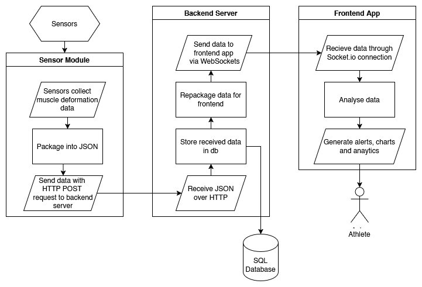

# Technical Architecture Document
***MatStat - Team 3***

## Overview
- **Backend:** Flask-based REST API with WebSocket support
- **Frontend:** React + Vite application with TypeScript
- **Sensors:** Embedded microcontrollers (simulated using `sensor_data_generator.py`)

## System Components

### 1. Sensor Layer
- **Hardware:** Wearable bodysuit with embedded force sensors positioned on key muscle groups
- **Sensor Software:** Lightweight program running on microcontrollers to collect, format, and transmit sensor data
- **Simulated Implementation:** `sensor_data_generator.py` simulates sensors with various training scenarios (normal, fatigue, asymmetry)
- **Communication Protocol:** HTTP POST requests to backend API

### 2. Backend Layer
- **Framework:** Flask (Python)
- **Database:** SQLAlchemy ORM with migration support via Flask-Migrate
- **Real-time Communication:** Flask-SocketIO for WebSocket connections
- **Key Components:**
    - REST API endpoints for receiving sensor data
    - WebSocket server for streaming processed data to frontend
    - Data persistence and session management
    - Analysis engine for detecting anomalies and dangerous patterns
- **Models:**
    - `TrainingSession`: Tracks overall training sessions
    - `SensorReading`: Stores individual sensor data points

### 3. Frontend Layer
- **Framework:** React 18 with TypeScript
- **Build Tool:** Vite
- **UI Components:** Custom components with shadcn/ui
- **Styling:** TailwindCSS with custom MatStat theme
- **State Management:** React hooks and context
- **Data Visualization:** Recharts for real-time graphs
- **Real-time Updates:** Socket.IO client
- **Key Features:**
    - Real-time muscle force monitoring
    - Visual body diagrams showing muscle status
    - Asymmetry and overexertion alerts
    - Session analytics and historical performance tracking

## Data Flow


### Data Acquisition
- Sensors measure muscle force/deformation at configurable frequency (10Hz in simulation)
- Data is formatted into JSON payload with timestamp and sensor readings

### Data Transmission
```json
{
        "timestamp": 1632145782000,
        "sensors": [
                {
                        "id": 1,
                        "output": 0.75
                }
        ]
}
```

### Backend Processing
- Backend receives sensor data via HTTP POST to `/api/sensor_data`
- Data is validated, processed, and stored in database
- Associated with active training session
- Enriched data streamed to connected clients via WebSockets

### Frontend Visualization
- Client connects to WebSocket server and subscribes to session updates
- Processes incoming data to calculate derived metrics:
    - Fatigue percentage
    - Asymmetry between muscle pairs
    - Force trends over time
- Updates UI components in real-time
- Triggers alerts when dangerous conditions detected

### Alert System
```typescript
interface AlertData {
    triggered: boolean;
    type: 'asymmetry' | 'overexertion' | 'none';
    affectedMuscle?: string;
    severity: 'low' | 'moderate' | 'high';
    metrics: {
        current: number;
        threshold: number;
        difference?: number;
    };
    recommendation: string;
}
```

## Deployment Architecture

### Development Environment
- **Backend:** Flask development server with debug mode enabled
- **Frontend:** Vite dev server with hot module replacement
- **Database:** SQLite for simplicity
- **Sensor Simulation:** Python script for generating test data

## Technical Decisions

### Why Flask for Backend?
- Lightweight and flexible for prototype development
- Excellent WebSocket support via Flask-SocketIO
- Easy integration with SQLAlchemy for data persistence
- Simple to extend with additional analysis modules

### Why React + TypeScript for Frontend?
- Component-based architecture ideal for complex UI elements
- TypeScript provides type safety for complex data structures
- Large ecosystem of charting and visualization libraries
- React Hooks simplify state management

### Why WebSockets?
- Low-latency bidirectional communication
- Efficient for streaming real-time sensor data
- Allows server to push alerts and updates immediately
- Reduces overhead compared to polling approaches

## Future Enhancements

### Machine Learning Integration
- Predictive modeling for injury prevention
- Personalized fatigue thresholds based on historical data
- Anomaly detection for identifying unusual patterns

### Mobile Application
- Native mobile experience for athletes on-the-go
- Bluetooth connectivity directly to sensors

### Data Analytics Platform
- Extended analytics for coaches and sports scientists
- Training load optimization algorithms
- Team-wide performance tracking

### Hardware Improvements
- Miniaturized sensors with longer battery life
- Wireless charging capabilities
- Integration with other biometric sensors (heart rate, temperature)

## Security Considerations
- Authentication and authorization for user data access
- Encryption for sensitive athlete health information
- Secure WebSocket connections (WSS)
- Input validation to prevent injection attacks
- Rate limiting to prevent API abuse

## Conclusion
The ASK system combines modern web technologies with sensor data processing to create a comprehensive muscle monitoring solution. The architecture balances real-time performance with scalability, allowing for future enhancements while delivering immediate value through injury prevention and performance optimization.

## Research References

1. Kuriakose, Ivin, et al. "Wearable pressure sensor suit for real-time detection of incorrect exercise techniques." 2022 IEEE Sensors. IEEE, 2022.

2. Alvarez, Jonathan T., et al. "Towards soft wearable strain sensors for muscle activity monitoring." IEEE Transactions on Neural Systems and Rehabilitation Engineering 30 (2022): 2198-2206.